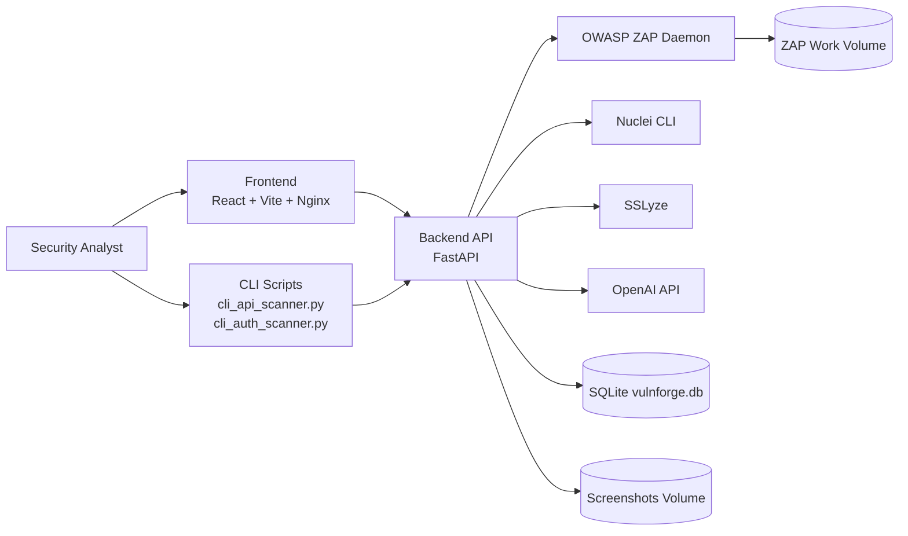
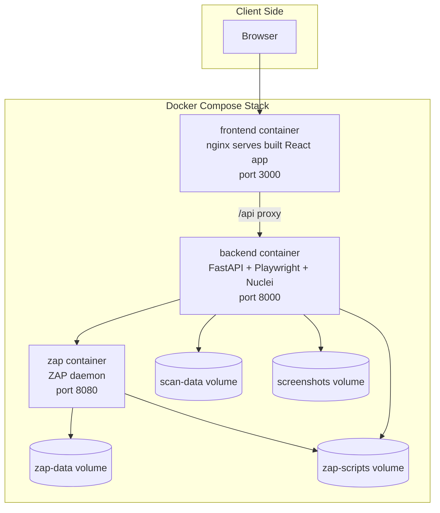
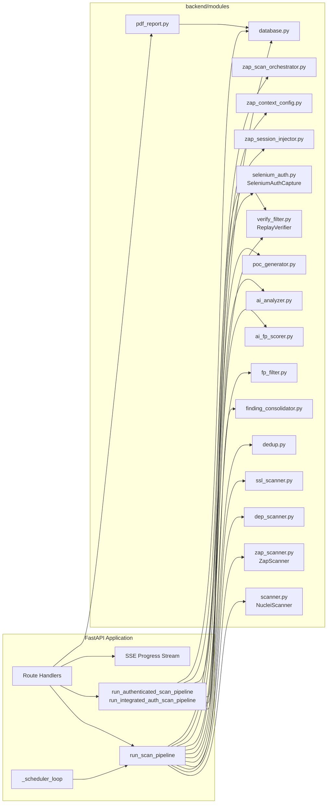
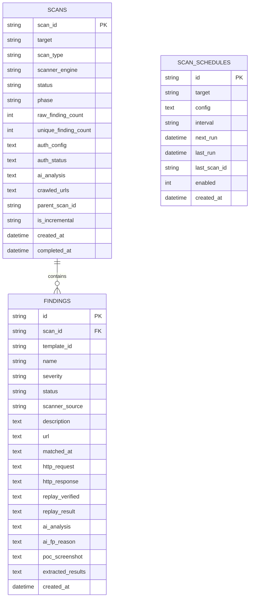
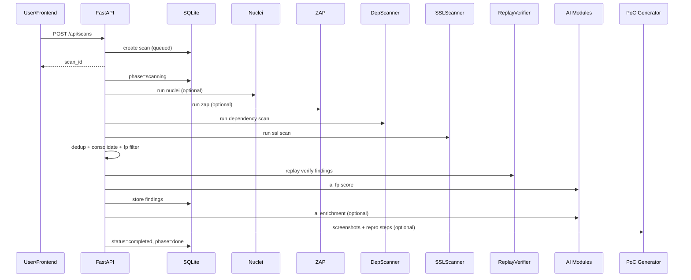
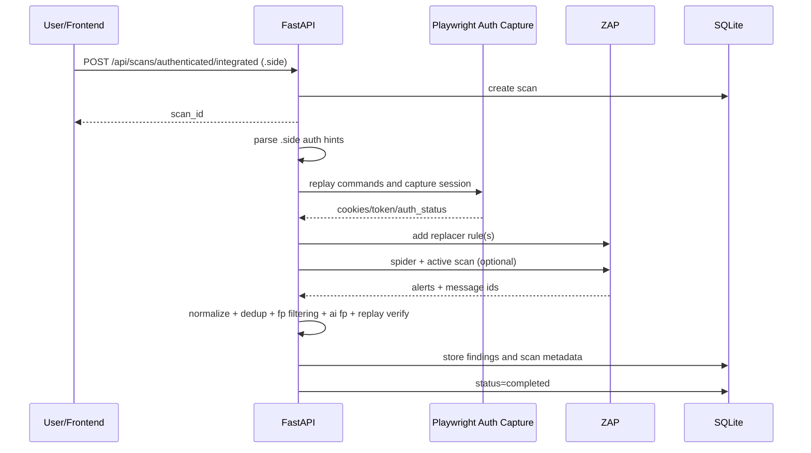

# VulnForge Platform Architecture

## 1. Scope

VulnForge is an AI-assisted vulnerability scanning platform with three main responsibilities:
- Orchestrate scanning workflows (Nuclei, ZAP, dependency SCA, SSL/TLS checks).
- Normalize, deduplicate, verify, enrich, and persist findings.
- Provide real-time scan operations and reporting through API, SSE, and a React dashboard.

This document reflects the architecture implemented in the current codebase.

## 2. System Context

## 3. Container and Runtime Architecture

### 3.1 Docker Compose Topology

### 3.2 Local Dev Topology

`start-dev.sh` starts backend and frontend locally. ZAP is not auto-started in local mode.

Expected local endpoints:
- Frontend: `http://localhost:5173`
- Backend: `http://localhost:8000`
- ZAP: start separately (for ZAP-dependent flows)

## 4. Backend Component Architecture

### 4.1 Core Application Layer

Implemented in `backend/main.py`.

Primary responsibilities:
- API route surface.
- Scan lifecycle management.
- Scheduling loop for recurring scans.
- Background task orchestration.
- SSE progress streaming.
- PDF report endpoints.

### 4.2 Service and Module Boundaries

## 5. Scan Pipelines

## 5.1 Standard Scan Pipeline (`POST /api/scans`)

Execution path in `run_scan_pipeline`:
1. Initialize scan status and phase.
2. Run Nuclei (optional by engine), with template update and incremental URL exclusion when available.
3. Run ZAP (optional by engine), including pre-login Selenium session capture for form auth when needed.
4. Run dependency SCA scan (`dep_scanner`) and SSL/TLS scan (`ssl_scanner`).
5. Deduplicate and consolidate findings.
6. Apply rule-based FP filtering.
7. Replay injection findings (`ReplayVerifier`) using captured auth where available.
8. Apply AI FP scorer for low-confidence findings.
9. Persist final findings in SQLite.
10. Optional AI enrichment and risk scoring.
11. Optional evidence capture with screenshots and reproduction steps.
12. Mark scan completed or failed.

## 5.2 Integrated Authenticated Pipeline (`POST /api/scans/authenticated/integrated`)

Execution path in `run_integrated_auth_scan_pipeline`:
1. Parse uploaded `.side` Selenium IDE file for auth hints and commands.
2. Replay login flow via Playwright (`SeleniumAuthCapture`) and capture session cookies/token.
3. Inject captured session into ZAP Replacer rules.
4. Optionally run ZAP spider and active scan.
5. Normalize alerts, deduplicate, FP filter, AI FP score.
6. Pull raw HTTP request/response by ZAP message IDs.
7. Replay-verify findings.
8. Persist findings, optional AI analysis, and screenshot evidence.
9. Mark scan completed or failed and clean temporary auth rules.

### 5.3 Scan State Model

Scan statuses observed in DB/API:
- `queued`
- `scanning`
- `authenticating`
- `running`
- `completed`
- `failed`

Major phase values used for progress:
- `initializing`
- `template_update`
- `nuclei_scan`
- `zap_scan`
- `zap_auth_check`
- `selenium_login`
- `zap_session_injection`
- `zap_context_config`
- `zap_spider`
- `dep_scan`
- `ssl_scan`
- `deduplication`
- `consolidation`
- `fp_filtering`
- `ai_fp_scoring`
- `storing_findings`
- `ai_analysis`
- `evidence_capture`
- `done`
- `error`

## 6. Data Architecture

Persistence is SQLite (WAL mode) through `backend/modules/database.py`.

### 6.1 Core Entities

- `scans`
- `findings`
- `scan_schedules`

### 6.2 Logical Data Model

### 6.3 Data Lifecycle

1. Scan request creates a `scans` row.
2. Pipeline phases update scan counters, phase, auth status, and optional AI summary.
3. Final findings are inserted into `findings`.
4. Dashboard endpoints aggregate over `scans` and `findings`.
5. Scheduler creates future scans based on `scan_schedules`.

## 7. API Architecture

### 7.1 Domain Grouping

- Scan lifecycle: `/api/scans`, `/api/scans/{scan_id}`, `/api/scans/{scan_id}/rescan`
- Progress streaming: `/api/scans/{scan_id}/progress/stream`
- Findings management: `/api/findings`, `/api/findings/{finding_id}`
- Dashboard analytics: `/api/dashboard/*`
- Target history: `/api/targets`, `/api/targets/{target}/history`
- Scheduling: `/api/schedules*`
- Authentication workflows and uploads:
  - `/api/upload/auth-session`
  - `/api/upload/selenium-test`
  - `/api/auth/capture-session-selenium`
  - `/api/scans/authenticated/run`
  - `/api/scans/authenticated/integrated`
- Reporting: `/api/scans/{scan_id}/report/pdf`, `/api/scans/report/bulk-pdf`

### 7.2 Real-Time Progress

Progress is delivered via SSE by polling the current scan state and pushing:
- `status`
- `phase`
- counts (`raw_finding_count`, `unique_finding_count`)
- terminal error or completion metadata

## 8. Frontend Architecture

Implemented primarily in `frontend/Dashboard.jsx`.

Responsibilities:
- Launch and monitor scans.
- Configure authentication (manual and `.side` upload driven).
- Subscribe to SSE progress stream.
- Display findings, trends, and severity distribution.
- Trigger reporting and history workflows through API.

UI and data access pattern:
- REST calls to `/api/*` via shared helper.
- Event-driven updates from SSE for in-flight scans.
- Derived dashboard metrics from backend aggregate endpoints.

## 9. Security and Trust Boundaries

- Browser to frontend/backend is the user trust boundary.
- Backend to ZAP/Nuclei/SSLyze executes active security tests against target systems.
- Authenticated scans handle credentials/session tokens in transit and in memory.
- ZAP API key protects daemon control endpoints.
- AI enrichment sends finding context to external model provider when enabled.

Controls in current implementation:
- ZAP API key usage.
- File size/type checks for `.side` upload endpoints.
- Separation of scanner work data and screenshot artifacts via mounted volumes.
- Replay verification and FP filtering to reduce noisy outputs.

## 10. Operational Architecture

### 10.1 Background and Async Work

- FastAPI background tasks run scan pipelines.
- Scheduler loop triggers periodic scans.
- Async semaphore limits concurrency for screenshot generation.
- Non-fatal module failures (dep scan, ssl scan, consolidation, AI) are logged and do not always abort full pipeline.

### 10.2 Health and Reliability

- Container health checks for backend and ZAP.
- ZAP startup dependency gate in Compose (`depends_on` with healthy condition).
- WAL mode in SQLite for better concurrent read/write behavior.
- Incremental scanning support using prior crawled URL set.

### 10.3 Scale Characteristics

Current architecture is single-node and stateful:
- SQLite local file persistence.
- In-process scheduler and background workers.
- Designed for single backend instance unless DB/task orchestration are externalized.

## 11. Key Sequence Diagrams

### 11.1 Standard Full Scan

### 11.2 Integrated Authenticated Scan

## 12. Extension Points

Safe extension points in the current design:
- Add scanner engines by conforming to normalized finding schema and integrating before dedup phase.
- Add post-processing stages between `fp_filtering` and `storing_findings`.
- Add report formats alongside PDF generator.
- Add auth adapters by producing session material consumable by ZAP injection and replay verifier.
- Externalize DB and job queue for multi-worker scale.
