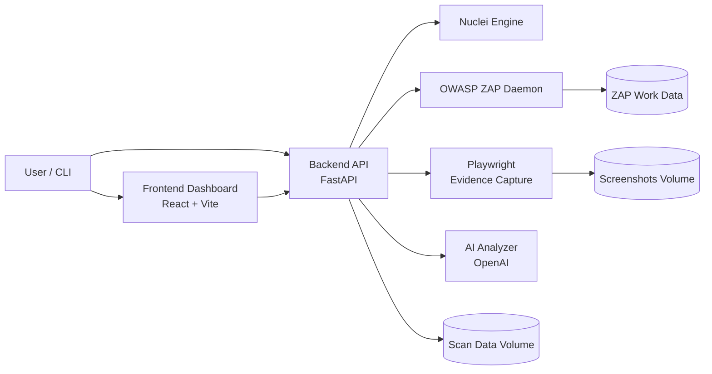

# DAST-Scanner Platform

AI-assisted vulnerability scanning platform that combines **OWASP ZAP**, **Nuclei**, **FastAPI**, **Playwright**, and a **React dashboard** for authenticated and unauthenticated DAST workflows.

## Highlights

- Unified scanning pipeline with `nuclei`, `zap`, or `both`
- Authenticated scanning support (cookie/bearer/header/script + Selenium session capture)
- Finding deduplication and false-positive filtering
- Optional AI analysis and risk enrichment
- Evidence capture with per-finding screenshots and steps to reproduce
- PDF report export (single scan and bulk)
- CLI helpers for automation and CI/CD usage

## Tech Stack

- Backend: FastAPI, Uvicorn, Playwright, ReportLab
- Scanners: OWASP ZAP, Nuclei
- Frontend: React + Vite + Recharts
- Runtime: Docker Compose (recommended)

## Repository Layout

- `backend/` — API server and scanning modules
- `frontend/` — dashboard UI
- `selinium/` — Selenium IDE/session utilities (existing project folder name)
- `docker-compose.yml` — full stack orchestration
- `cli_api_scanner.py` / `cli_auth_scanner.py` — CLI automation tools
- `ALL_DOCUMENTATION.md` — merged detailed project documentation

## Architecture

### High-Level System



### Backend Module Responsibilities

- `main.py` — API orchestration, scan lifecycle, background execution
- `modules/scanner.py` — Nuclei scan execution
- `modules/zap_scanner.py` — ZAP health, crawl, active scan, alert normalization
- `modules/integrated_auth_scanner.py` + auth modules — authenticated scanning workflow
- `modules/dedup.py` / `modules/fp_filter.py` — deduplication and false-positive filtering
- `modules/ai_analyzer.py` — optional AI enrichment and risk context
- `modules/poc_generator.py` — screenshot/evidence capture and reproduction artifacts
- `modules/pdf_report.py` — PDF report generation
- `modules/database.py` — persistence layer for scans/findings/metadata

### Scan Processing Pipeline

1. Request accepted (`/api/scans` or authenticated scan endpoints)
2. Discovery and active scanning via selected engine (`nuclei`, `zap`, or `both`)
3. Findings normalization, deduplication, and false-positive filtering
4. Optional AI analysis and enrichment
5. Evidence capture (screenshots + steps to reproduce)
6. Findings persisted and exposed via API/dashboard
7. Optional PDF report export

## Quick Start (Docker)

### 1) Prerequisites

- Docker + Docker Compose

### 2) Optional environment

Create `.env` in the repository root (optional but recommended):

```bash
OPENAI_API_KEY=your_key_here
OPENAI_MODEL=gpt-4o
```

### 3) Start services

```bash
docker compose up -d --build
```

### 4) Access

- Frontend: http://localhost:3000
- Backend API: http://localhost:8000
- API Docs (Swagger): http://localhost:8000/docs
- ZAP API (internal daemon exposed locally): http://localhost:8080

## Local Development (without Docker)

Use the provided bootstrap script:

```bash
./start-dev.sh
```

This script installs dependencies, installs Playwright Chromium, and starts:
- Backend on `http://localhost:8000`
- Frontend on `http://localhost:5173`

## API Quick Usage

### Start a scan

```bash
curl -X POST http://localhost:8000/api/scans \
  -H "Content-Type: application/json" \
  -d '{
    "target": "https://example.com",
    "scan_type": "full",
    "scanner_engine": "both",
    "severity_filter": ["critical","high","medium","low","info"],
    "tags": [],
    "generate_poc": true,
    "ai_analysis": true
  }'
```

### Check scan status

```bash
curl http://localhost:8000/api/scans/<scan_id>
```

### Download PDF report

```bash
curl -L http://localhost:8000/api/scans/<scan_id>/report/pdf -o report.pdf
```

## Key API Endpoints

- `POST /api/scans`
- `GET /api/scans`
- `GET /api/scans/{scan_id}`
- `GET /api/scans/{scan_id}/findings`
- `POST /api/scans/authenticated/run`
- `POST /api/scans/authenticated/integrated`
- `POST /api/upload/selenium-test`
- `POST /api/auth/capture-session-selenium`
- `GET /api/scans/{scan_id}/report/pdf`
- `GET /api/scans/report/bulk-pdf`
- `GET /api/health`

## Logs & Troubleshooting

### Backend logs

```bash
docker compose logs -f backend
```

### Evidence-generation related logs

```bash
docker compose logs backend --since=24h | grep -Ei "evidence|screenshot|poc"
```

### ZAP logs

```bash
docker compose logs -f zap
```

### Frontend logs

```bash
docker compose logs -f frontend
```

## Notes

- Use only on systems you own or are explicitly authorized to test.
- Some targets may block browser navigation for asset/document URLs; screenshot warnings can appear while the scan still completes.

## License

No license file is currently defined in this repository. Add a `LICENSE` file before publishing publicly.
