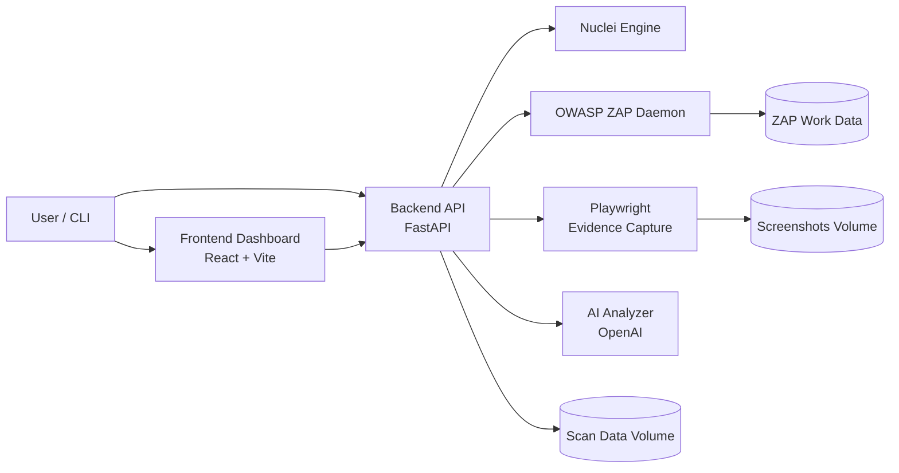

# DAST-Scanner Platform

AI-assisted vulnerability scanning platform that combines **OWASP ZAP**, **Nuclei**, **FastAPI**, **Playwright**, **SSL/TLS analysis**, **dependency fingerprinting**, and a **React dashboard** for authenticated and unauthenticated security testing workflows.

## Highlights

- Unified scan pipeline with `nuclei`, `zap`, or `both`
- Additional dependency/SCA and SSL/TLS checks during the main scan pipeline
- Authenticated scanning via cookie, bearer, header, ZAP auth script, Selenium capture, or Selenium IDE `.side` upload
- Scheduled scans, full rescans, target history, and incremental URL reuse
- Real-time scan progress streaming over SSE
- Finding deduplication, consolidation, deterministic replay verification, and AI-assisted false-positive scoring
- Optional AI analysis and risk enrichment with OpenAI
- Evidence capture with auth-proof screenshots, per-finding screenshots, and steps to reproduce
- PDF report export for single scans and bulk reporting
- CLI helpers for automation and CI/CD usage

## Recent Updates

- Added scheduled scans with `daily`, `weekly`, and `monthly` intervals
- Added scan rescan support and target-specific scan history endpoints
- Added incremental scan behavior by reusing previously discovered URLs
- Added dependency scanning backed by Retire.js-style matching, Wappalyzer-style fingerprinting, OSV, and NVD lookups
- Added SSL/TLS scanning via `sslyze`
- Added SSE progress streaming at `/api/scans/{scan_id}/progress/stream`
- Added replay-based false-positive reduction and AI FP scoring for low/medium-confidence ZAP findings
- Added authenticated `.side` upload and integrated Selenium-to-ZAP authenticated scan orchestration

## Tech Stack

- Backend: FastAPI, Uvicorn, Playwright, ReportLab
- Scanners: OWASP ZAP, Nuclei, `sslyze`
- Dependency Intel: Retire.js-style library matching, Wappalyzer-style tech fingerprinting, OSV, NVD
- AI: OpenAI-compatible analysis and FP scoring
- Frontend: React + Vite + Recharts
- Runtime: Docker Compose (recommended)

## Repository Layout

- `backend/` — API server and scanning modules
- `frontend/` — dashboard UI
- `selinium/` — Selenium IDE/session utilities (existing project folder name)
- `docker-compose.yml` — full stack orchestration
- `cli_api_scanner.py` / `cli_auth_scanner.py` — CLI automation tools
- `ALL_DOCUMENTATION.md` — merged detailed project documentation

## Architecture

### High-Level System



### Backend Module Responsibilities

- `main.py` — API orchestration, scan lifecycle, background execution
- `modules/scanner.py` — Nuclei scan execution
- `modules/zap_scanner.py` — ZAP health, crawl, active scan, alert normalization
- `modules/integrated_auth_scanner.py` + auth modules — authenticated scanning workflow
- `modules/dep_scanner.py` — dependency/SCA fingerprinting and CVE lookup
- `modules/ssl_scanner.py` — SSL/TLS misconfiguration and certificate scanning
- `modules/dedup.py` / `modules/fp_filter.py` — deduplication and rule-based false-positive filtering
- `modules/finding_consolidator.py` — multi-instance finding grouping
- `modules/verify_filter.py` — replay-based verification of injection findings
- `modules/ai_fp_scorer.py` — AI false-positive scoring for weak-confidence ZAP alerts
- `modules/ai_analyzer.py` — optional AI enrichment and risk context
- `modules/poc_generator.py` — screenshot/evidence capture and reproduction artifacts
- `modules/pdf_report.py` — PDF report generation
- `modules/database.py` — persistence layer for scans/findings/metadata

### Scan Processing Pipeline

1. Request accepted (`/api/scans` or authenticated scan endpoints)
2. Discovery and active scanning via selected engine (`nuclei`, `zap`, or `both`)
3. Dependency/SCA and SSL/TLS checks run as part of the pipeline
4. Findings normalization, deduplication, consolidation, and rule-based false-positive filtering
5. Replay verification and AI FP scoring reduce transient/weak-confidence findings
6. Optional AI analysis and enrichment
7. Evidence capture (screenshots + steps to reproduce)
8. Findings persisted and exposed via API/dashboard
9. Optional PDF report export

## Quick Start (Docker)

### 1) Prerequisites

- Docker + Docker Compose

### 2) Optional environment

Copy `.env.example` to `.env` in the repository root (recommended):

```bash
cp .env.example .env

OPENAI_API_KEY=your_key_here
OPENAI_MODEL=gpt-4o
```

### 3) Start services

```bash
docker compose up -d --build
```

### 4) Access

- Frontend: http://localhost:3000
- Backend API: http://localhost:8000
- API Docs (Swagger): http://localhost:8000/docs
- ZAP API (internal daemon exposed locally): http://localhost:8080

## Local Development (without Docker)

Use the provided bootstrap script:

```bash
./start-dev.sh
```

What the script does:
- installs backend dependencies
- installs Playwright Chromium
- installs frontend dependencies
- starts the backend and frontend dev servers

Important local-dev assumptions:
- `nuclei` must already be installed and available on `PATH`
- the script does not start ZAP for you
- for full ZAP-backed scanning in local mode, start ZAP separately or run only the ZAP service with Docker Compose

Example:

```bash
docker compose up -d zap
./start-dev.sh
```

Local dev endpoints:
- Backend on `http://localhost:8000`
- Frontend on `http://localhost:5173`

If `OPENAI_API_KEY` is not set, AI features fall back to heuristic behavior where supported.

## API Quick Usage

### Start a scan

```bash
curl -X POST http://localhost:8000/api/scans \
  -H "Content-Type: application/json" \
  -d '{
    "target": "https://example.com",
    "scan_type": "full",
    "scanner_engine": "both",
    "severity_filter": ["critical","high","medium","low","info"],
    "tags": [],
    "generate_poc": true,
    "ai_analysis": true
  }'
```

### Check scan status

```bash
curl http://localhost:8000/api/scans/<scan_id>
```

### Stream live scan progress

```bash
curl -N http://localhost:8000/api/scans/<scan_id>/progress/stream
```

### Create a recurring scan schedule

```bash
curl -X POST http://localhost:8000/api/schedules \
  -H "Content-Type: application/json" \
  -d '{
    "target": "https://example.com",
    "scan_type": "full",
    "scanner_engine": "both",
    "interval": "weekly"
  }'
```

### Download PDF report

```bash
curl -L http://localhost:8000/api/scans/<scan_id>/report/pdf -o report.pdf
```

## Key API Endpoints

- `POST /api/scans`
- `GET /api/scans`
- `GET /api/scans/{scan_id}`
- `GET /api/scans/{scan_id}/progress/stream`
- `POST /api/scans/{scan_id}/rescan`
- `DELETE /api/scans/{scan_id}`
- `GET /api/scans/{scan_id}/findings`
- `GET /api/findings`
- `GET /api/findings/{finding_id}`
- `PATCH /api/findings/{finding_id}`
- `GET /api/targets`
- `GET /api/targets/{target}/history`
- `GET /api/schedules`
- `POST /api/schedules`
- `PATCH /api/schedules/{schedule_id}`
- `DELETE /api/schedules/{schedule_id}`
- `POST /api/upload/auth-session`
- `POST /api/scans/authenticated/run`
- `POST /api/scans/authenticated/integrated`
- `POST /api/upload/selenium-test`
- `POST /api/auth/capture-session-selenium`
- `GET /api/scans/{scan_id}/report/pdf`
- `GET /api/scans/report/bulk-pdf`
- `GET /api/health`

## Logs & Troubleshooting

### Backend logs

```bash
docker compose logs -f backend
```

### Evidence-generation related logs

```bash
docker compose logs backend --since=24h | grep -Ei "evidence|screenshot|poc"
```

### Verification / auth / scheduling related logs

```bash
docker compose logs backend --since=24h | grep -Ei "replay|auth|schedule|incremental|dep scan|ssl"
```

### ZAP logs

```bash
docker compose logs -f zap
```

### Frontend logs

```bash
docker compose logs -f frontend
```

## Notes

- Use only on systems you own or are explicitly authorized to test.
- Some targets may block browser navigation for asset/document URLs; screenshot warnings can appear while the scan still completes.
- In Docker mode, the backend container bundles Nuclei and Playwright Chromium.
- In local mode, ZAP is external and must be reachable by the backend at the configured API URL.

## License

No license file is currently defined in this repository. Add a `LICENSE` file before publishing publicly.